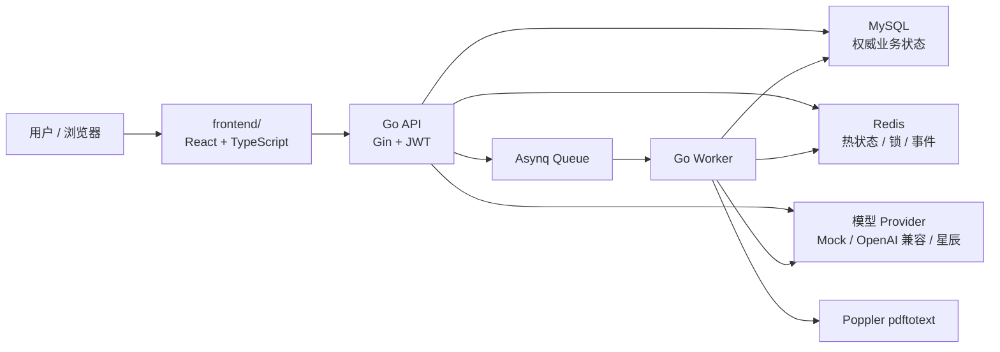

# AI Meeting

面向实习项目展示的 AI 模拟面试平台。后端使用 Go 提供认证、简历分析、面试状态治理、答题评分和报告接口；前端位于 `frontend/`，使用 React，并与后端独立启动。

## 当前能力

- 账号体系：注册、登录、Access Token 鉴权、Refresh Token 轮换与整族撤销，密码使用 bcrypt 摘要保存。
- 简历驱动出题：校验 PDF 文件签名、类型和大小，通过 Poppler 提取文本；扫描版或低质量文本返回 `PDF_OCR_REQUIRED`。
- 异步分析：Asynq Worker 在后台提取简历并生成题目，前端通过 SSE 获取任务状态，断线后可从 MySQL 补查最终结果。
- 模型接入：支持 `mock`、OpenAI 兼容接口和讯飞星辰工作流三种模式。星辰模式直接调用出题、答案评分、提问三个顶层工作流，简历评分由出题工作流内部完成。
- 答题与追问：校验当前题，解析和限制评分范围，按规则决定追问；每道主问题最多两轮追问，追问不重复计入主问题总分。
- 幂等与并发：答题要求 `Idempotency-Key`，结合数据库唯一约束、处理租约、会话版本和 Redis 题级锁，避免重复推进和重复计分。
- 长会话恢复：MySQL 保存权威状态，Redis 保存 24 小时热状态。缓存缺失、过期、版本落后或不可用时从 MySQL 重建。
- 面试报告：提供简历得分、回答得分、综合评分、雷达指标和逐题回放；已完成或失败的历史面试可由用户确认后删除。
- 浏览器语音：输入使用 Web Speech API，题目播放使用 `speechSynthesis`；不支持语音或权限被拒绝时始终可以使用文字输入。

## 架构概览



固定调用方向为：`Handler → Application Service → Domain → Repository / External Provider`。API 和 Worker 共享领域模型与模型 Provider，但分别作为独立进程运行。

## 技术栈

- Backend：Go 1.24、Gin、GORM、MySQL Driver、go-redis、Asynq、JWT、bcrypt、golang-migrate、slog、Prometheus Client。
- Frontend：React 19、TypeScript、Vite、Redux Toolkit、TanStack Query、Tailwind CSS、Radix UI、Vitest。
- Infrastructure：MySQL 8.4、Redis 7.2、Docker Compose、Poppler。
- LLM：Mock、本地配置的 OpenAI 兼容 Chat API，或讯飞星辰工作流 API。

## 快速开始

### 1. 准备环境

建议版本：

- Docker Desktop 或 Docker Engine
- Node.js 20+
- npm 10+
- Go 1.24+（仅在宿主机直接开发或测试后端时需要）

### 2. 配置模型（可选）

默认 `LLM_MODE=mock`，不配置模型密钥也能演示完整业务流程。需要使用真实模型时，在项目根目录复制配置模板：

```powershell
Copy-Item .env.example .env
```

`.env` 只能保存在本机，不应提交。不同模式所需配置如下：

| 模式 | 必需配置 | 作用范围 |
| --- | --- | --- |
| `mock` | 无 | 使用固定题目、评分与追问结果，验证业务闭环 |
| `openai` | `LLM_BASE_URL`、`LLM_API_KEY`、`LLM_MODEL` | 简历出题、答案评分和追问 |
| `xingchen` | 三组 `XINGCHEN_*_API_KEY`、`API_SECRET`、`FLOW_ID` | 分别调用出题、答案评分和提问工作流 |

星辰模式缺少出题或评分工作流配置时，对应能力回退 Mock；提问工作流缺失或调用失败时由答题管线使用已有建议继续处理。OpenAI 兼容模式的调用错误会沿任务重试或答题错误路径返回。不要把真实 Key 写入 README、示例配置、SQL、截图或工作流导出文件。

### 3. 启动后端

在项目根目录执行：

```powershell
docker compose up -d --build
docker compose ps -a
```

Compose 会启动 MySQL、Redis、一次性迁移组件、API 和 Worker。`migrate` 成功后显示 `Exited (0)` 是正常状态；API 和 Worker 只有在迁移成功后才会启动。

默认地址：

```text
API:        http://localhost:8080
存活检查:   http://localhost:8080/health/live
就绪检查:   http://localhost:8080/health/ready（检查 MySQL）
指标:       http://localhost:8080/metrics
```

### 4. 启动前端

打开另一个 PowerShell 窗口：

```powershell
Set-Location frontend
npm install
npm run dev
```

访问 `http://localhost:5173`。开发服务器会把 `/api` 请求代理到后端，默认目标为 `http://localhost:8080`。

## 使用流程

1. 打开前端，注册或登录账号。
2. 创建面试会话并上传文本型 PDF 简历。
3. 等待异步分析完成，进入模拟面试室。
4. 使用浏览器语音或文字回答；转写结果可人工修改后再提交。
5. 查看评分和动态追问；刷新页面时由服务端状态恢复历史轮次和当前题。
6. 完成或主动结束面试后查看报告与逐题回放。
7. 在历史面试中可删除本人已完成或失败的记录；进行中的记录只能继续面试。

## API 摘要

公开接口：

| Method | Path | 说明 |
| --- | --- | --- |
| `POST` | `/api/v1/auth/register` | 注册 |
| `POST` | `/api/v1/auth/login` | 登录并签发双 Token |
| `POST` | `/api/v1/auth/refresh` | 轮换 Refresh Token |
| `POST` | `/api/v1/auth/logout` | 撤销 Token family |
| `GET` | `/health/live` | 存活检查 |
| `GET` | `/health/ready` | MySQL 就绪检查 |
| `GET` | `/metrics` | Prometheus 指标 |

以下接口需要 `Authorization: Bearer <access_token>`：

| Method | Path | 说明 |
| --- | --- | --- |
| `GET` | `/api/v1/auth/me` | 当前用户 |
| `POST` | `/api/v1/interviews` | 创建会话 |
| `GET` | `/api/v1/interviews` | 本人历史面试 |
| `DELETE` | `/api/v1/interviews/{id}` | 删除本人已完成或失败的面试 |
| `POST` | `/api/v1/interviews/{id}/resume` | 上传 PDF 并创建分析任务 |
| `GET` | `/api/v1/interviews/{id}/resume` | 鉴权预览简历 |
| `GET` | `/api/v1/interviews/{id}/state` | 获取完整恢复状态 |
| `POST` | `/api/v1/interviews/{id}/answers` | 提交答案，要求 `Idempotency-Key` |
| `POST` | `/api/v1/interviews/{id}/finish` | 主动结束并生成报告 |
| `GET` | `/api/v1/interviews/{id}/report` | 查看报告与回放 |
| `GET` | `/api/v1/jobs/{jobId}` | 查询分析任务状态 |
| `GET` | `/api/v1/jobs/{jobId}/events` | SSE 获取分析进度 |

统一响应包含 `success`、`code`、`message`、`data` 和 `requestId`。

## 目录结构

```text
.
├── cmd/
│   ├── api/                    # HTTP API 入口
│   ├── migrate/                # 数据库迁移入口
│   └── worker/                 # Asynq Worker 入口
├── internal/
│   ├── auth/                   # 双 Token 认证
│   ├── interview/              # 会话、答题、状态机与恢复
│   ├── resume/                 # PDF 提取与质量门禁
│   ├── evaluation/             # 追问规则
│   ├── report/                 # 报告生成与查询
│   ├── llm/                    # Mock / OpenAI / 星辰 Provider
│   ├── job/                    # 异步任务与 SSE
│   ├── storage/                # 数据库、Redis 与文件存储
│   └── platform/               # HTTP 公共能力
├── migrations/                 # 版本化 MySQL 迁移
├── frontend/                   # React 前端
├── docs/                       # 决策、追溯、进度与提交安全说明
├── scripts/                    # 验证和演示脚本
├── docker-compose.yml
└── go.mod
```

## 数据与状态治理

MySQL 保存用户、Refresh Token、面试会话、简历资产、分析任务、题目、答题尝试、成功轮次和报告。所有用户业务查询都校验 `user_id`，会话使用 `version` 做乐观并发控制。

```text
CREATED → ANALYZING → READY → IN_PROGRESS → COMPLETED
                     ↘ FAILED
```

Redis 保存当前题、追问次数、累计分、轮次序号、版本、锁和任务事件，热状态 TTL 为 24 小时。Redis 不可用时，系统可使用 MySQL 权威数据继续恢复和答题；极端情况下可能重复调用一次模型，但唯一约束和版本校验禁止重复推进与重复计分。

## 常用命令

后端完整测试：

```powershell
go test ./...
```

项目静态与容器配置验证：

```powershell
.\scripts\verify.ps1
```

前端检查与构建：

```powershell
Set-Location frontend
npm run check
npm run build
```

查看或停止本地服务：

```powershell
docker compose ps -a
docker compose down
```

`docker compose down` 不删除数据卷。不要在含有需要保留的账号和面试记录时执行带 `-v` 的命令。

## 当前边界

- 只处理可提取文本的 PDF，不提供 OCR。
- 不做摄像头、表情或仪态评分。
- 浏览器语音依赖 Chrome / Edge 的 Web Speech API；当前没有接入云端 ASR 或长语音 TTS。
- 不提供通用聊天、Agent 管理后台或动态模型管理页面。
- MySQL 是权威存储；不使用 MongoDB。
- Mock 模式用于本地演示和自动测试，不代表真实模型效果。

## 提交前安全检查

真实密钥、简历、运行数据、构建产物和本地缓存均不应进入版本库。完整清单和检查步骤见 [docs/DO_NOT_COMMIT.md](docs/DO_NOT_COMMIT.md)。

## 追溯与决策

- [docs/REFERENCE_MAP.md](docs/REFERENCE_MAP.md)：模块实现依据和差异。
- [docs/DECISIONS.md](docs/DECISIONS.md)：关键架构决策。
- [docs/PROGRESS.md](docs/PROGRESS.md)：量化验收与测试证据。

## 许可证

根工程当前未单独声明开源许可证。`frontend/LICENSE` 保留了前端来源代码的 MIT 许可和原始版权信息；对外发布或商用前，应确认整个工程的许可证和第三方资源授权。
