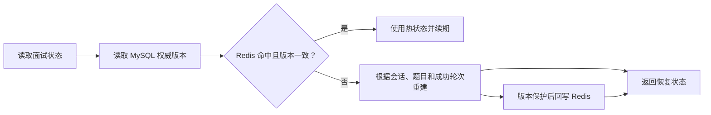
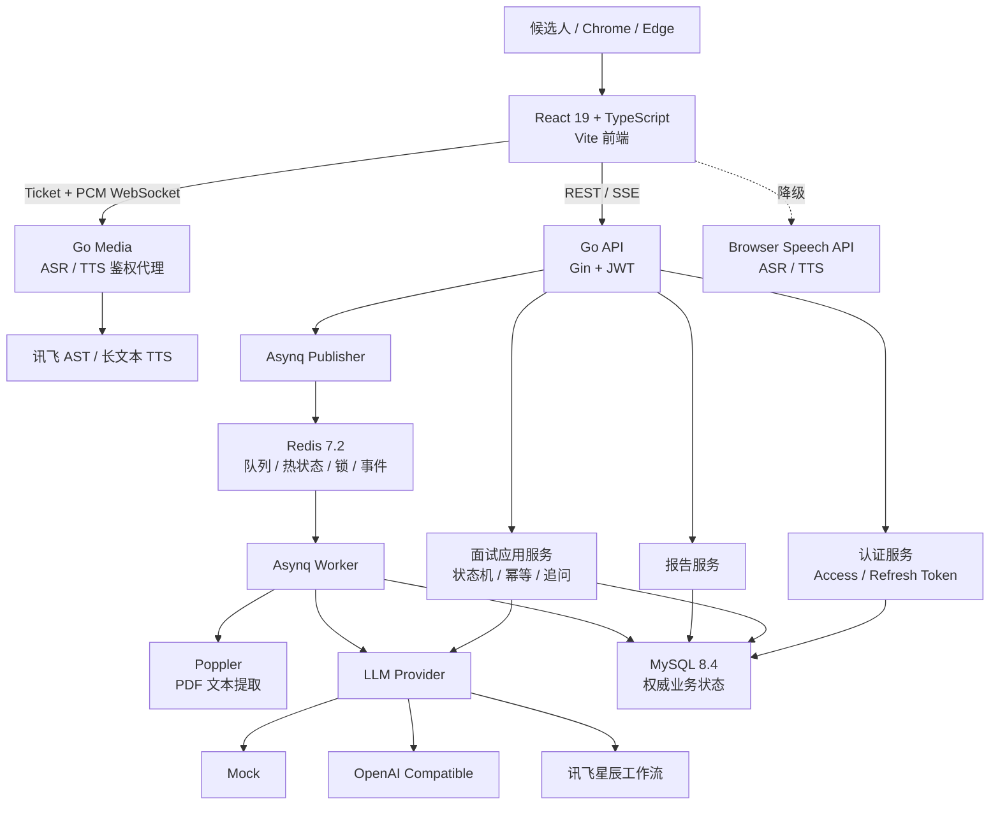

<div align="center">


# AI Meeting ·

**简历驱动、动态追问、可恢复的 AI 模拟面试平台**

从 PDF 简历分析到面试报告复盘，完成一次具备工程化状态治理的完整面试闭环。


</div>

## 项目介绍

AI Meeting 是一个 Go + React 实现的 AI 模拟面试平台。候选人上传 PDF 简历后，系统异步提取简历内容并生成个性化问题；答题阶段结合模型评分和本地规则进行动态追问；面试结束后生成包含综合评分、能力雷达和逐题回放的报告。

项目不只关注“调用一次大模型”，还处理了面试过程中更容易被忽略的工程问题：重复提交、并发答题、模型输出不稳定、Redis 故障、页面刷新、长会话恢复和异步任务断线补查。

```text
双 Token 登录
    ↓
PDF 简历上传 → 异步提取与出题 → SSE 进度通知
    ↓
浏览器语音/文字回答 → 模型评分 → Go 规则裁决 → 动态追问
    ↓
MySQL 权威状态 + Redis 热状态 → 刷新恢复与故障降级
    ↓
综合报告 → 雷达指标 → 逐题回放
```

## 核心亮点

### 1. 简历驱动的异步出题

- 上传接口校验扩展名、MIME、PDF 文件签名和 10 MiB 大小限制。
- Worker 使用 Poppler `pdftotext` 提取文本，并执行 UTF-8、控制字符、文本长度等质量门禁。
- 扫描版或无法可靠提取的 PDF 返回 `PDF_OCR_REQUIRED`，避免乱码进入模型上下文。
- Asynq 负责后台任务；任务状态写入 MySQL，SSE 负责实时通知。
- SSE 连接先读取数据库快照，再订阅 Redis 事件并定时补查，降低断线和完成事件丢失的影响。

### 2. 规则与模型协作的动态追问

评分模型返回分数、反馈、遗漏点和追问建议，Go 规则负责最终裁决：

```text
已达到两轮上限        → 不再追问
模型建议追问          → 追问
分数低于 60           → 追问
存在遗漏点            → 追问
均不满足              → 进入下一道主问题
```

确定需要追问后，再调用独立提问能力生成问题。生成失败时优先使用评分结果中的追问建议，仍无内容时使用通用降级问题。追问最多两轮，且不重复计入主问题总分。

### 3. 幂等、防重与并发推进

- 每次答题要求 `Idempotency-Key`，数据库保存处理状态和可回放响应。
- `answer_attempts(session_id, idempotency_key)` 唯一约束防止重复业务提交。
- Redis 题级锁减少同一道题的并发模型调用。
- 会话行锁和 `version` 乐观锁保证只有一个请求能够推进状态。
- `PROCESSING` 请求带处理租约，服务异常后允许过期任务接管。
- Redis 故障时允许极端情况下多产生一次模型调用，但禁止重复计分和重复推进。

### 4. 可恢复的长会话状态

MySQL 是权威数据源，Redis 只保存可丢弃的 24 小时热状态：



页面刷新后，前端使用 `/state` 返回的历史轮次整体重建对话，不依赖浏览器内存中的旧状态。Redis 不可用时，读取和答题链路可以降级到 MySQL，并通过 `X-Degraded-Mode: mysql` 标记降级模式。

### 5. 讯飞优先的可降级语音能力

- 实时转写优先通过一次性 Ticket 连接 Go WebSocket，再由 Go 代理讯飞 AST。
- AST 分片支持 `apd/rpl`、时间范围文本演进、乱序和标点去重，并以原子快照更新页面。
- 题目播放优先使用讯飞长文本 TTS；音频必须登录鉴权并由 Go 流式代理，上游地址不会暴露给浏览器。
- 讯飞不可用时依次降级到浏览器 Web Speech API / `speechSynthesis`，文字输入永久可用。
- 录音、合成原文和音频文件均不落盘。

### 6. 从答题到报告的完整闭环

- 支持简历得分、回答得分和综合评分。
- 雷达指标根据已完成面试数据生成。
- 报告保留问题、回答、分数、反馈和追问标识，支持逐题复盘。
- 历史列表区分进行中和已完成会话：进行中进入恢复页面，已完成进入报告。
- 仅允许用户删除本人 `COMPLETED` 或 `FAILED` 状态的面试，所有权和状态在事务内重新校验。

## 系统架构



后端调用方向保持为：

```text
Handler → Application Service → Domain → Repository / External Provider
```

只为真正可替换的边界抽象接口，例如模型 Provider、PDF 提取、文件存储、热状态存储、任务发布、时钟和 ID 生成器。

## 功能模块

### 用户与认证

- 用户注册、登录和当前用户查询。
- Access Token + Refresh Token 双 Token。
- Refresh Token 只保存哈希、family 和撤销状态。
- Refresh Token 轮换以及旧 Token 重放时整族撤销。
- bcrypt 密码摘要和用户数据隔离。

### 简历与任务

- 安全上传、鉴权预览和本地文件存储。
- 文本型 PDF 提取与乱码质量门禁。
- Asynq 异步分析、失败重试和任务状态持久化。
- SSE 进度、最终状态补查和 `Last-Event-ID` 支持。

### 面试与追问

- `CREATED → ANALYZING → READY → IN_PROGRESS → COMPLETED / FAILED` 状态流转。
- 当前题校验、答案评分、追问裁决、题目推进和完成判断。
- 主问题最多两轮追问，追问独立保存但不重复累计主问题分数。
- 幂等结果回放、处理租约、Redis 锁和数据库并发保护。

### 状态恢复与降级

- MySQL 权威状态、Redis 热状态和 24 小时 TTL。
- Redis 版本校验、击穿重建锁和缓存回写保护。
- Redis 丢失或完全不可用时从 MySQL 重建。
- 前端根据服务端成功轮次恢复历史问答、反馈和当前题。

### 报告与历史

- 面试报告、能力雷达、综合结论和逐题回放。
- 本人历史面试列表和状态感知跳转。
- 已完成或失败面试的事务级联删除。

## 模型接入

项目支持三种运行模式：

| `LLM_MODE` | 配置 | 行为 |
| --- | --- | --- |
| `mock` | 无 | 使用固定题目、评分和追问，适合本地演示与自动测试 |
| `openai` | `LLM_BASE_URL`、`LLM_API_KEY`、`LLM_MODEL` | 使用 OpenAI 兼容 Chat Completions 接口完成出题、评分和追问 |
| `xingchen` | 三组星辰工作流凭据 | 分别调用出题、答案评分和提问工作流 |

星辰模式直接配置三个顶层工作流：

```text
QUESTION 工作流    → 简历分析、简历评分、生成主问题
EVALUATION 工作流  → 答案评分、反馈、遗漏点、追问建议
ASKING 工作流      → 根据简历、问题和回答生成追问内容
```

简历评分位于出题工作流内部，不需要第四组凭据。当前无摄像头评分，因此没有接入表情分析工作流。

## 技术栈

### 后端

| 技术 | 版本/用途 |
| --- | --- |
| Go | 1.24，后端开发语言 |
| Gin | HTTP 路由与中间件 |
| GORM + MySQL Driver | 关系型数据访问 |
| MySQL | 8.4，权威业务数据 |
| Redis + go-redis | 7.2，热状态、锁和任务事件 |
| Asynq | 异步简历分析任务 |
| golang-migrate | 版本化数据库迁移 |
| JWT + bcrypt | 双 Token 认证和密码摘要 |
| slog + Prometheus | 结构化日志与指标 |
| Poppler | PDF 文本提取 |

### 前端

| 技术 | 版本/用途 |
| --- | --- |
| React | 19.2，UI 框架 |
| TypeScript | 5.9，类型系统 |
| Vite | 7.3，开发与构建工具 |
| React Router | 7.13，页面路由 |
| Redux Toolkit | 2.11，全局状态 |
| TanStack Query | 5.90，服务端状态和缓存 |
| Tailwind CSS + Radix UI | 样式与无障碍组件原语 |
| React PDF | 鉴权 PDF 预览 |
| Vitest + Testing Library | 单元和组件测试 |

## 快速开始

### 环境要求

- Docker Desktop 或 Docker Engine
- Node.js 20+
- npm 10+
- Go 1.24+（仅宿主机开发和测试后端时需要）

### 1. 配置环境变量

默认使用 Mock 模式，无需任何模型密钥即可启动：

```powershell
Copy-Item .env.example .env
```

使用真实模型时编辑本机 `.env`。不要把真实 API Key 写入示例、代码、SQL、截图或文档。

### 2. 启动后端

```powershell
docker compose up -d --build
docker compose ps -a
```

Compose 启动以下组件：

| 组件 | 作用 | 正常状态 |
| --- | --- | --- |
| `mysql` | 权威数据库 | `healthy` |
| `redis` | 队列、热状态、锁和事件 | `healthy` |
| `migrate` | 一次性执行数据库迁移 | `Exited (0)` |
| `api` | HTTP API | `running` |
| `worker` | 异步简历分析 | `running` |

服务地址：

```text
API          http://localhost:8080
存活检查     http://localhost:8080/health/live
就绪检查     http://localhost:8080/health/ready
指标         http://localhost:8080/metrics
```

### 3. 启动前端

打开另一个 PowerShell：

```powershell
Set-Location frontend
npm install
npm run dev
```

访问 `http://localhost:5173`。Vite 会把 `/api` 代理到 `http://localhost:8080`。

### 4. 体验完整流程

1. 注册或登录账号。
2. 创建面试并上传文本型 PDF 简历。
3. 等待简历分析和题目生成。
4. 使用语音或文字回答，并人工确认转写结果。
5. 查看评分反馈和动态追问。
6. 刷新页面验证历史轮次与当前题恢复。
7. 完成面试后查看雷达图和逐题报告。

也可以使用 PowerShell 演示脚本验证后端闭环：

```powershell
.\scripts\demo.ps1 -ResumePath "D:\path\to\resume.pdf"
```

## 测试与质量保障

统一后端验证：

```powershell
.\scripts\verify.ps1
```

该脚本依次执行：

- `go build ./...`
- `go test ./...`
- `go vet ./...`
- `docker compose config --quiet`
- 参考文件真实性检查

前端完整检查：

```powershell
Set-Location frontend
npm run check
npm run build
```

当前前端共有 **27 个测试文件、108 项测试**，覆盖认证、请求鉴权、语音去重、TTS、简历任务、刷新恢复、报告数据和历史面试删除等关键链路。

关键异常场景包括：

- Token 轮换、撤销、重放和用户越权。
- 非 PDF、伪造 MIME、超限和扫描版 PDF。
- 模型错误 JSON、越界分数、限流和超时。
- 相同幂等键并发提交和同一道题并发推进。
- Redis 状态过期、版本落后和完全不可用。
- 浏览器重复 partial/final 事件和语音权限拒绝。
- SSE 断线重连后的最终状态补查。

## 目录结构

```text
.
├── cmd/
│   ├── api/                    # Gin API 入口
│   ├── migrate/                # 数据库迁移入口
│   └── worker/                 # Asynq Worker 入口
├── internal/
│   ├── auth/                   # 双 Token 认证
│   ├── interview/              # 会话、答题、状态机与恢复
│   ├── evaluation/             # 追问规则
│   ├── resume/                 # PDF 提取与质量门禁
│   ├── job/                    # 异步任务与 SSE
│   ├── llm/                    # Mock / OpenAI / 星辰 Provider
│   ├── report/                 # 报告生成与查询
│   ├── storage/                # MySQL、Redis 与文件存储
│   └── platform/               # HTTP 公共能力
├── migrations/                 # MySQL 版本化迁移
├── frontend/                   # React 前端
├── docs/                       # 架构决策、追溯和接口文档
├── scripts/                    # 验证与演示脚本
├── docker-compose.yml
└── go.mod
```

<details>
<summary><strong>API 摘要</strong></summary>

公开接口：

| Method | Path | 说明 |
| --- | --- | --- |
| `POST` | `/api/v1/auth/register` | 注册 |
| `POST` | `/api/v1/auth/login` | 登录并签发双 Token |
| `POST` | `/api/v1/auth/refresh` | 轮换 Refresh Token |
| `POST` | `/api/v1/auth/logout` | 撤销 Token family |
| `GET` | `/health/live` | 存活检查 |
| `GET` | `/health/ready` | MySQL 就绪检查 |
| `GET` | `/metrics` | Prometheus 指标 |

需要 Access Token：

| Method | Path | 说明 |
| --- | --- | --- |
| `GET` | `/api/v1/auth/me` | 当前用户 |
| `POST` | `/api/v1/interviews` | 创建面试 |
| `GET` | `/api/v1/interviews` | 本人历史面试 |
| `DELETE` | `/api/v1/interviews/{id}` | 删除本人终态面试 |
| `POST` | `/api/v1/interviews/{id}/resume` | 上传 PDF 并创建任务 |
| `GET` | `/api/v1/interviews/{id}/resume` | 鉴权预览简历 |
| `GET` | `/api/v1/interviews/{id}/state` | 完整恢复状态 |
| `POST` | `/api/v1/interviews/{id}/answers` | 提交答案，要求 `Idempotency-Key` |
| `POST` | `/api/v1/interviews/{id}/finish` | 主动结束并生成报告 |
| `GET` | `/api/v1/interviews/{id}/report` | 报告与逐题回放 |
| `GET` | `/api/v1/jobs/{jobId}` | 查询任务状态 |
| `GET` | `/api/v1/jobs/{jobId}/events` | SSE 获取任务进度 |

</details>

## 当前边界

- 只解析文本型 PDF，暂不提供 OCR。
- 不做摄像头、表情或仪态评分。
- 云端 ASR/TTS 需要单独配置讯飞 `APP_ID`、`API_KEY`、`API_SECRET`；未配置或调用失败时使用浏览器语音降级。
- 不提供通用聊天、Agent 管理后台或动态模型配置后台。
- 未 MongoDB；MySQL 保存全部权威业务状态。
- Mock 模式用于演示和测试，不代表真实模型质量。

## 项目文档

- [OpenAPI](docs/openapi.yaml)：HTTP 接口契约。
- [架构决策](docs/DECISIONS.md)：认证、状态、任务、语音和模型接入决策。
- [状态机](docs/STATE_MACHINE.md)：会话和答题状态流转。
- [数据模型](docs/ER.md)：MySQL 实体关系。
- [实现追溯](docs/REFERENCE_MAP.md)：模块依据、差异和对应测试。
- [量化进度](docs/PROGRESS.md)：验收项和真实验证证据。
- [提交安全](docs/DO_NOT_COMMIT.md)：禁止提交文件和发布前检查清单。

## 安全与许可证

真实密钥、`.env`、用户简历、运行数据、日志、缓存、`node_modules` 和 `dist` 均不应进入版本库，详见 [提交安全清单](docs/DO_NOT_COMMIT.md)。

根工程当前未单独声明开源许可证。`frontend/LICENSE` 保留前端来源代码的 MIT 许可与原始版权信息；
