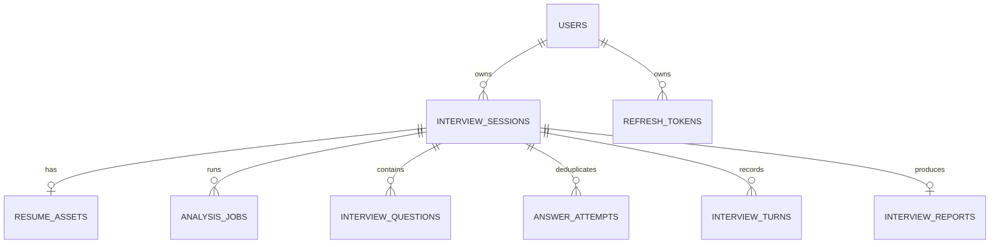

# 数据关系

```mermaid
erDiagram
  USERS ||--o{ INTERVIEW_SESSIONS : owns
  USERS ||--o{ REFRESH_TOKENS : owns
  INTERVIEW_SESSIONS ||--o| RESUME_ASSETS : has
  INTERVIEW_SESSIONS ||--o{ ANALYSIS_JOBS : runs
  INTERVIEW_SESSIONS ||--o{ INTERVIEW_QUESTIONS : contains
  INTERVIEW_SESSIONS ||--o{ ANSWER_ATTEMPTS : deduplicates
  INTERVIEW_SESSIONS ||--o{ INTERVIEW_TURNS : records
  INTERVIEW_SESSIONS ||--o| INTERVIEW_REPORTS : produces
```
