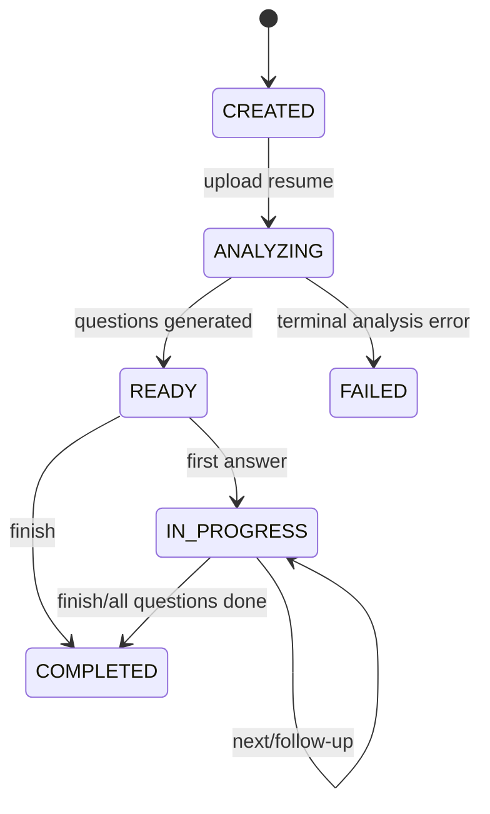

# 面试状态机

```mermaid
stateDiagram-v2
  [*] --> CREATED
  CREATED --> ANALYZING: upload resume
  ANALYZING --> READY: questions generated
  ANALYZING --> FAILED: terminal analysis error
  READY --> IN_PROGRESS: first answer
  IN_PROGRESS --> IN_PROGRESS: next/follow-up
  READY --> COMPLETED: finish
  IN_PROGRESS --> COMPLETED: finish/all questions done
```

Handler 不得直接修改状态；所有流转由 interview application service 完成并使用数据库版本号保护。
